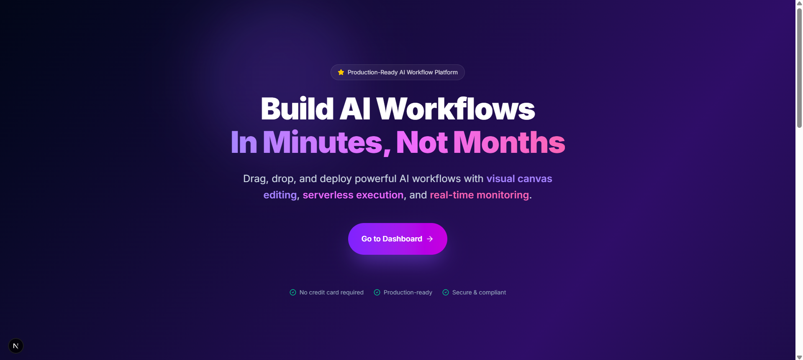

# 🧠 AI Workflow Automation Platform


*(Note: Please add a screenshot of the main canvas here and name it `banner.png` in the public/screenshots folder)*

## 🚀 Overview
This project is a **visual, node-based editor** for building and orchestrating complex AI workflows. Built with **Next.js 14** and **React Flow**, it allows users to chain together Large Language Models (LLMs), image processors, and other utility nodes into intelligent pipelines.

It features a real-time execution engine powered by **Google Gemini**, capable of handling multimodal inputs (Text + Images) and persisting execution history for later review.

## ✨ Key Features

### 1. Visual Workflow Builder
- **Drag-and-Drop Interface:** Intuitive canvas for arranging nodes.
- **Smart Connection Validation:** Prevents invalid connections (e.g., Image → Text) and detects cycles (DAG validation).
- **Custom Nodes:**
  - **LLM Node:** Multimodal input support (System Prompt, User Message, Images). Inline streaming responses.
  - **Multimedia Nodes:** Upload Image/Video, Crop Image, Extract Frame from Video.
  - **Logic Nodes:** Text input, System instructions.

### 2. Intelligent Execution Engine
- **Multimodal Processing:** Connect a cropped image and a video frame directly to an LLM context.
- **Real-time Feedback:** Visual status indicators (Running, Success, Failed) on every node.
- **Secure Integration:** Server-side execution using Google Gemini API.

### 3. Workflow History & Persistence
- **Run History Sidebar:** Auto-updating list of all past executions.
- **Deep Inspection:** Click any run to see exactly what went into and came out of every node (Tokens, Latency, Errors).
- **Database Persistence:** All workflow states and run results are saved to a tailored SQLite database via Prisma.

### 4. Enterprise-Grade Architecture
- **Authentication:** Clerk integration for secure user management.
- **Type Safety:** Full TypeScript implementation across Frontend and Backend.
- **Clean Code:** Modular architecture separating UI (React Flow) from Logic (Execution Engine).

## 🛠️ Technology Stack

| Category | Technologies |
|----------|-------------|
| **Frontend** | Next.js 14, React, Tailwind CSS, React Flow (@xyflow/react), Lucide Icons |
| **Backend** | Next.js API Routes, Node.js |
| **Database** | SQLite, Prisma ORM |
| **AI / ML** | Google Gemini Pro Vision (via Google Generative AI SDK) |
| **Auth** | Clerk |
| **State** | Zustand (with Temporal middleware for Undo/Redo) |

## 📸 visual Tour

### The Editor Canvas
> The core workspace where users build their AI logic.


### LLM Node (Multimodal)
> An LLM node accepting both text prompt and image inputs.


### Execution History
> Detailed logs of every step in the pipeline.


## 🏃‍♂️ Getting Started

### Prerequisites
- Node.js 18+
- npm or pnpm
- A Google Gemini API Key

### Installation

1. **Clone the repository**
   ```bash
   git clone https://github.com/yourusername/ai-workflow-platform.git
   cd ai-workflow-platform
   ```

2. **Install dependencies**
   ```bash
   npm install
   ```

3. **Configure Environment**
   Create a `.env` file:
   ```env
   # Database
   DATABASE_URL="file:./dev.db"

   # Auth (Clerk)
   NEXT_PUBLIC_CLERK_PUBLISHABLE_KEY=pk_test_...
   CLERK_SECRET_KEY=sk_test_...

   # AI Provider
   GEMINI_API_KEY=AIzaSy...
   ```

4. **Initialize Database**
   ```bash
   npx prisma migrate dev --name init
   ```

5. **Run the Development Server**
   ```bash
   npm run dev
   ```

## 🏗️ Architecture Highlights

### Data Model
The project uses a relational schema to track:
- **Workflows:** JSON definition of nodes and edges.
- **Runs:** Execution instances with status and timing.
- **NodeResults:** Granular output and error logs for each step.

### Execution Flow
1. **Validation:** The engine validates the Directed Acyclic Graph (DAG) before running.
2. **Topological Sort:** Determines the correct execution order.
3. **Execution:** Nodes are processed sequentially (or in parallel where possible), passing data context to downstream nodes.
4. **Persistence:** State is constantly synced to the DB for history tracking.

---
*Built as a Full Stack Production Assignment.*
