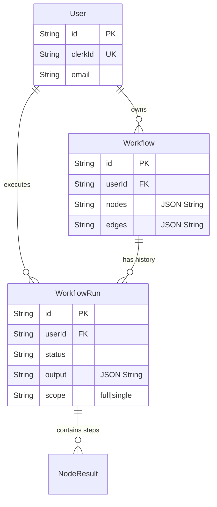

# 🗄️ Database Architecture & Design Documentation
> galaxy.ai - Fullstack Assignment

This document explains the database design, why specific choices were made, and how data flows in the application. It is written for a beginner level and includes common interview questions related to this architecture.

---

## 1. Technology Stack

### **Database Engine: SQLite**
*   **What it is:** A lightweight, file-based relational database. Unlike PostgreSQL or MySQL, it doesn't require a separate server process. The entire database is a single file (`prisma/dev.db`).
*   **Why we used it:**
    *   **Zero Configuration:** No need to install Docker or Postgres. Runs instantly on any machine.
    *   **Perfect for Development:** Excellent for assignments and prototyping.
    *   **Assignment Requirement:** Often preferred for "local setup" assignments to reduce complexity.

### **ORM: Prisma**
*   **What it is:** Object-Relational Mapper. It lets us write TypeScript code (`prisma.user.create`) instead of raw SQL queries (`INSERT INTO User...`).
*   **Why we used it:**
    *   **Type Safety:** It generates TypeScript types from your database schema automatically. If you change the DB, your code errors out instantly if it mismatches.
    *   **Migrations:** Handles creating tables and modifying columns safely.

---

## 2. Database Schema (The Blueprint)

The schema is defined in `prisma/schema.prisma`. Here is a breakdown of exactly what we store and why.

### **A. Model: `User`**
Stores identity information. We sync this with Clerk (Auth Provider).

| Field | Type | Purpose |
| :--- | :--- | :--- |
| `id` | String (CUID) | **Internal ID.** The UUID used within *our* database to link runs and workflows. |
| `clerkId` | String (Unique) | **External ID.** The ID provided by Clerk (e.g., `user_2...`). We use this to look up our internal User. |
| `email` | String | User's email address. |
| `credits` | Int | (Optional/Future) For tracking API usage limits. |

> **Why check `clerkId` vs `id`?**
> Authentication (Clerk) gives us a `clerkId`. But our database relations need a stable internal `id`. We intentionally query `User` by `clerkId` to find their internal `id` before saving any data. This decouples our DB from the Auth provider.

### **B. Model: `Workflow`**
Stores the visual graph (Canvas state).

| Field | Type | Purpose |
| :--- | :--- | :--- |
| `id` | String (CUID) | Unique ID for the workflow. |
| `userId` | String | Foreign Key linking to `User`. |
| `nodes` | String (JSON) | **The Graph Structure.** Stores the React Flow nodes array as a huge JSON string. |
| `edges` | String (JSON) | **The Connections.** Stores the React Flow edges array. |
| `name` | String | Display name of the workflow. |

> **Why store `nodes` as a String?**
> A workflow graph is complex and unstructured (inputs, positions, types vary wildly). Validating specific columns for every node property is rigid. Storing it as a "JSON Blob" (String) allows the frontend to save *exactly* what it sees and load it back perfectly without the database caring about the shape.

### **C. Model: `WorkflowRun`**
Stores the history of executed workflows. This is the core of the "Run History" feature.

| Field | Type | Purpose |
| :--- | :--- | :--- |
| `id` | String (CUID) | Unique Run ID. |
| `userId` | String | Who ran it? |
| `status` | String | `PENDING`, `COMPLETED`, `FAILED`. |
| `scope` | String | Did we run the `FULL` workflow or just `SINGLE` node? |
| `output` | String (JSON) | **The Results.** Stores the final output of every node (LLM text, Image URLs, etc.). |
| `createdAt` | DateTime | Timestamp for sorting history. |

### **D. Model: `NodeResult`**
(Optional but recommended) Stores granular details for each step in a run.

| Field | Type | Purpose |
| :--- | :--- | :--- |
| `runId` | String | Links to `WorkflowRun`. |
| `nodeId` | String | Which visual node is this result for? |
| `status` | String | `success` or `failed`. |
| `duration` | Int | How many milliseconds it took (latency tracking). |
| `output` | String | The specific output for this single step. |

---

## 3. Data Flow: "The Save & Fetch Cycle"

### **Saving a Run (The "WRITE" Path)**
1.  **Frontend:** User clicks "Run". Sends `nodes` and `edges` to `/api/execute`.
2.  **Backend:**
    *   Authenticates user (gets `clerkId`).
    *   Finds `dbUser` using `clerkId` -> gets `dbUser.id`.
    *   Creates a `WorkflowRun` with `status: 'RUNNING'`.
    *   Executes logic (LLM, Sorting).
    *   Updates `WorkflowRun` with `status: 'COMPLETED'` and `output: JSON.stringify(results)`.

### **Fetching History (The "READ" Path)**
1.  **Frontend:** `RunHistorySidebar` requests `/api/workflows/default/runs`.
2.  **Backend:**
    *   Authenticates user (`clerkId`).
    *   **CRITICAL STEP:** Finds `dbUser` using `clerkId` -> gets `dbUser.id`. (This was the bug fixed!).
    *   Queries `prisma.workflowRun.findMany({ where: { userId: dbUser.id } })`.
    *   Parses the `output` string back into JSON object.
3.  **Frontend:** Receives JSON, maps it to the timeline UI.

---

## 4. Interview Questions & Answers

### **Q1: Why did you store `nodes` and `output` as a String instead of a JSON type?**
*   **Answer:** "SQLite does not have a native `JSON` column type like PostgreSQL does. While Prisma supports `Json` type for Postgres, mapping it to SQLite often requires treating it as a String internally. Storing it as a serialized string ensures compatibility and prevents serialization errors during development, although in a production Postgres DB, I would switch to `JSONB` for better query performance."

### **Q2: What is the difference between `clerkId` and the database `id`?**
*   **Answer:** "`clerkId` is the external unique identifier controlled by the Authentication Provider (Clerk). The database `id` is the internal primary key controlled by my application. I map them 1-to-1. This allows me to switch auth providers in the future (e.g., to Auth0 or Firebase) without breaking all the database relationships, as the internal foreign keys rely on `id`, not the external provider ID."

### **Q3: How would you scale this if we had 1 million runs?**
*   **Answer:**
    1.  **Switch to PostgreSQL:** SQLite cannot handle high concurrent writes well due to file locking.
    2.  **Pagination:** The current API fetches `take: 10`. This is good practice. I would add cursor-based pagination for infinite scrolling.
    3.  **Archiving:** Move old runs (older than 30 days) to "Cold Storage" (e.g., S3 or a separate analytics DB) to keep the primary table light.

### **Q4: Why `prisma generate`?**
*   **Answer:** "Prisma creates a custom TypeScript client based on the schema. Every time the schema changes, `prisma generate` must be run to update the `node_modules/@prisma/client` types. This ensures that if I rename a column in the DB, my code won't compile until I update it, preventing runtime crashes."

---

## 5. Schema Diagram (Textual)

